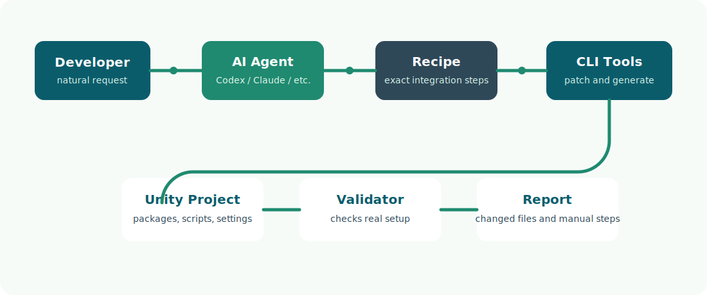
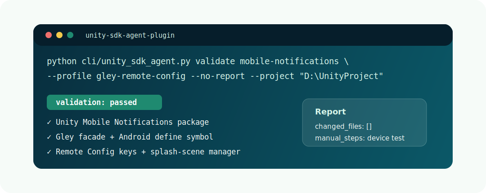

<p align="center">
  
</p>

<p align="center">
  <a href="#current-scope"></a>
  <a href="#mobile-notifications"></a>
  <a href="#agent-support"></a>
  <a href="LICENSE"></a>
</p>

<p align="center">
  <strong>Agent-ready Unity SDK integration packs for AI coding agents.</strong>
  <br />
  Give Codex, Claude, Antigravity, or another coding agent tested recipes, templates, and validators so Unity SDK work becomes repeatable.
</p>

<p align="center">
  <a href="#quick-start">Quick Start</a>
  |
  <a href="#mobile-notifications">Mobile Notifications</a>
  |
  <a href="#agent-support">Agent Support</a>
  |
  <a href="docs/roadmap.md">Roadmap</a>
</p>

---

## Why This Exists

AI coding agents are good at editing Unity projects, but SDK integrations are fragile when every agent has to rediscover the setup from scratch.

This repo acts as a **Unity SDK integration memory layer**:

| Problem | What this repo adds |
| --- | --- |
| Agents guess SDK steps | Exact recipes and profiles |
| Integrations miss project settings | Validation checks |
| Third-party SDKs vary by project | Implementation profiles |
| Users need repeatable results | CLI tools and templates |
| Future SDKs need structure | One pack per integration |

## How It Works

<p align="center">
  
</p>

```text
Developer request
  -> AI agent reads this plugin
  -> Recipe selects exact SDK steps
  -> CLI/templates apply safe changes
  -> Validator checks the project
  -> Agent reports changed files and manual steps
```

## Quick Start

Add mobile notifications to a Unity project:

```powershell
python cli/unity_sdk_agent.py add mobile-notifications --project "D:\Path\To\UnityProject"
```

Validate only:

```powershell
python cli/unity_sdk_agent.py validate mobile-notifications --project "D:\Path\To\UnityProject"
```

Validate an existing Gley + Firebase Remote Config setup:

```powershell
python cli/unity_sdk_agent.py validate mobile-notifications --profile gley-remote-config --no-report --project "D:\Path\To\UnityProject"
```

Install the bundled Gley plugin into a Unity project:

```powershell
python cli/unity_sdk_agent.py install-gley --project "D:\Path\To\UnityProject"
```

<p align="center">
  
</p>

## Mobile Notifications

`mobile-notifications` is the first integration pack.

| Profile | Purpose | Status |
| --- | --- | --- |
| `basic` | Direct Unity Mobile Notifications wrapper | Working MVP |
| `gley-remote-config` | Validates a production-style Gley + Firebase Remote Config setup | Validated against a real Unity project |

The production profile checks:

- `com.unity.mobile.notifications` package
- Android define symbol `EnableNotificationsAndroid`
- Gley notification scripts
- Splash-scene `NotificationsManager`
- Firebase Remote Config keys `isNotificationActive` and `notificationHours`
- Notification icons `commonicon` and `smallicon`
- Permission, init, focus, and scheduling lifecycle

Bundled Gley path:

```text
vendor/gley-mobile-push-notifications/Assets/GleyPlugins
```

## Agent Support

| Agent/App | Entry Point | Status |
| --- | --- | --- |
| Codex | `codex/SKILL.md` | Ready |
| Claude | `claude/CLAUDE.md` | Ready |
| Antigravity | `antigravity/instructions.md` | Ready |
| Any terminal agent | `cli/unity_sdk_agent.py` | Ready |
| MCP-compatible apps | `mcp/README.md` | Planned |

Prompt for Codex or another coding agent:

```text
Use this repo as the Unity SDK Agent Plugin.
Read codex/SKILL.md first.
Add mobile notifications to my Unity project.
Validate after changes and summarize the report.
```

Prompt for an existing Gley + Firebase setup:

```text
Use this repo as the Unity SDK Agent Plugin.
Validate mobile notifications with the gley-remote-config profile.
Do not modify the project; use --no-report if running the CLI.
```

## Project Structure

```text
unity-sdk-agent-plugin/
  cli/
    unity_sdk_agent.py
  codex/
    SKILL.md
  claude/
    CLAUDE.md
  antigravity/
    instructions.md
  core/
    integrations/
      mobile-notifications/
        recipe.md
        recipe.yaml
        implementation-profile-gley-remote-config.md
        templates/
  docs/
    assets/
  mcp/
    README.md
```

## Current Scope

This is version `0.1`. It proves the agent-plugin system with one real SDK pack and one production validation profile.

This repo does **not** claim zero-mistake automation across all Unity projects yet. It currently provides:

- a working basic integration flow
- a validated production profile for a Gley + Firebase Remote Config notification setup
- agent instructions for multiple AI coding apps
- a structure for adding more SDK packs safely

## Documentation

| Document | Description |
| --- | --- |
| [Quickstart](QUICKSTART.md) | Fast usage examples |
| [How It Works](docs/how-it-works.md) | Architecture and safety model |
| [Mobile Notifications](core/integrations/mobile-notifications/README.md) | Integration-specific docs |
| [Gley + Firebase Profile](core/integrations/mobile-notifications/implementation-profile-gley-remote-config.md) | Production implementation profile |
| [Roadmap](docs/roadmap.md) | Planned SDK packs and tooling |
| [Contributing](docs/contributing.md) | How to add new integration packs |
| [Third-Party Assets](docs/third-party-assets.md) | How licensed assets like Gley should be handled |
| [Example Prompts](examples/prompts.md) | Copy-paste prompts for agents |

## Planned SDK Packs

- Crash reporting
- Analytics foundation
- Remote Config
- Localization
- Haptics
- Debug console
- Build info generator

## Important Notes

- Gley Mobile Push Notifications is vendored under `vendor/` with owner approval; verify ownership before redistributing.
- Firebase dashboard values must still be configured in Firebase.
- Mobile notification behavior must be tested on a real Android device.
- Recipes should be validated against real projects before being treated as production-ready.
